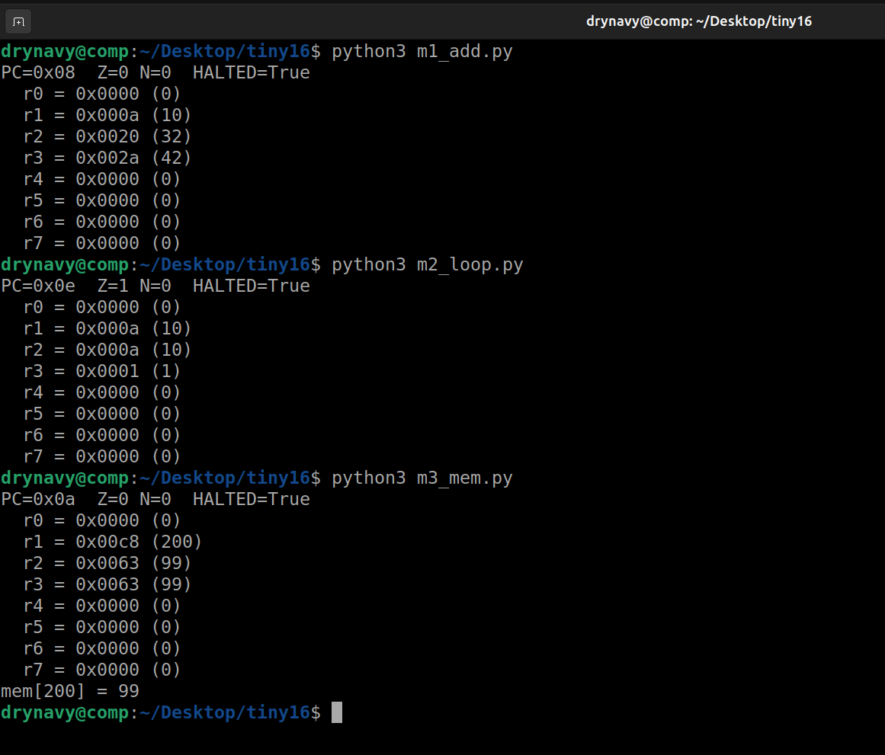
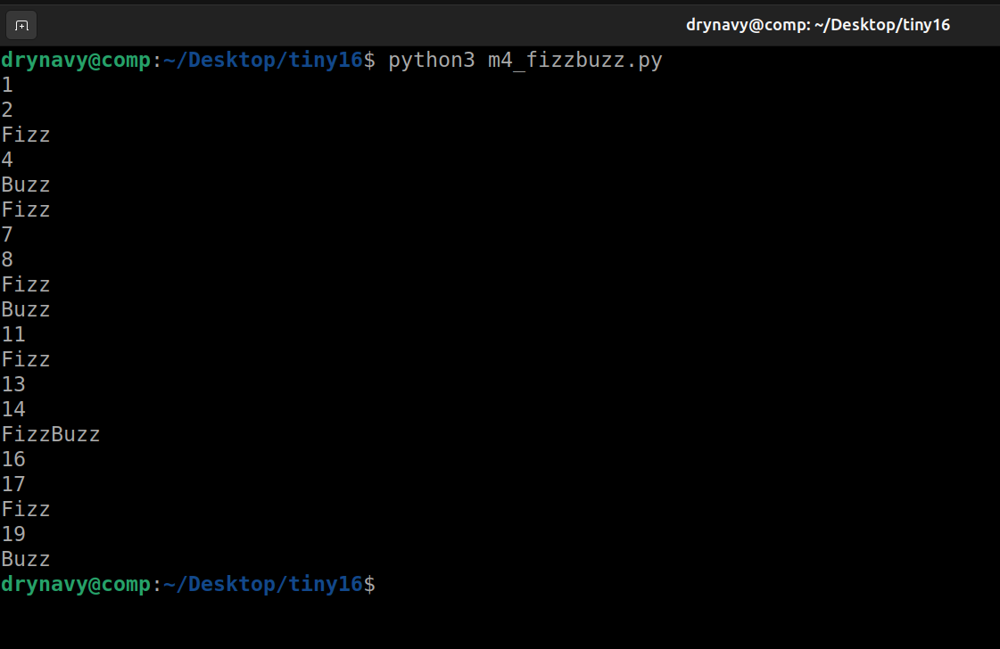

# TINY-16

A CPU emulator built around a custom 16-bit fantasy instruction set. TINY-16 implements the complete fetch-decode-execute cycle, a two-pass assembler, and a cycle-by-cycle trace mode. It is designed as a foundation for learning processor internals before moving to a real architecture such as RISC-V (RV32I).

## Overview

The emulator models the core components of a processor:

- A flat byte-addressable memory (256 bytes)
- Eight general-purpose registers (`r0`–`r7`), with `r0` hardwired to zero
- A program counter and Z/N status flags
- Fixed-width 16-bit instructions for straightforward decoding

A program is assembled from readable mnemonics into 16-bit instruction words, loaded into memory, and executed one instruction at a time.

## Instruction Set

Every instruction is 16 bits wide, divided into a 4-bit opcode and operand fields.

| Opcode | Mnemonic | Operands        | Semantics                          |
|--------|----------|-----------------|------------------------------------|
| 0x0    | NOP      | —               | No operation                       |
| 0x1    | LOAD     | rd, imm8        | rd = imm8                          |
| 0x2    | ADD      | rd, ra, rb      | rd = ra + rb                       |
| 0x3    | SUB      | rd, ra, rb      | rd = ra - rb                       |
| 0x4    | AND      | rd, ra, rb      | rd = ra & rb                       |
| 0x5    | OR       | rd, ra, rb      | rd = ra \| rb                      |
| 0x6    | MOD      | rd, ra, rb      | rd = ra % rb                       |
| 0x7    | CMP      | ra, rb          | Set Z if ra == rb, N if ra < rb    |
| 0x8    | JMP      | addr            | PC = addr                          |
| 0x9    | JZ       | addr            | Jump to addr if Z is set           |
| 0xA    | JNZ      | addr            | Jump to addr if Z is not set       |
| 0xB    | STORE    | ra, rb          | mem[ra] = rb                       |
| 0xC    | LOADR    | rd, ra          | rd = mem[ra]                       |
| 0xD    | HALT     | —               | Stop execution                     |

## Instruction Format

```
Bits:  [15..12]  [11..8]   [7..4]    [3..0]
       opcode    dest      src A     src B / immediate
```

Decoding extracts each field with a shift and a mask, for example `opcode = (instr >> 12) & 0xF`.

## Project Structure

| File              | Description                                          |
|-------------------|------------------------------------------------------|
| `cpu.py`          | The CPU: fetch-decode-execute loop, disassembler, trace mode |
| `asm.py`          | Two-pass assembler with label resolution             |
| `m1_add.py`       | Milestone 1: add two numbers                         |
| `m2_loop.py`      | Milestone 2: counting loop with branches             |
| `m2_loop_trace.py`| Milestone 2 with trace mode enabled                  |
| `m3_mem.py`       | Milestone 3: memory store and load                   |
| `m4_fizzbuzz.py`  | Milestone 4: FizzBuzz                                |

## Requirements

Python 3.8 or later. No external dependencies.

## Usage

Run any milestone directly:

```bash
python3 m1_add.py        # adds 10 + 32, result in r3
python3 m2_loop.py       # counts from 0 to 10
python3 m3_mem.py        # stores 99 at address 200 and reads it back
python3 m4_fizzbuzz.py   # runs FizzBuzz for 1 through 20
```

### Writing a Program

Programs are written in TINY-16 assembly and assembled at runtime:

```python
from cpu import CPU
from asm import assemble, load_program

SRC = """
    LOAD r1, 10
    LOAD r2, 32
    ADD  r3, r1, r2
    HALT
"""

cpu = CPU()
load_program(cpu, assemble(SRC))
cpu.run()
cpu.dump()
```

The assembler resolves labels to byte addresses, so loops and jumps reference names rather than manual offsets:

```
        LOAD r1, 0
        LOAD r2, 10
        LOAD r3, 1
loop:
        ADD  r1, r1, r3
        CMP  r1, r2
        JNZ  loop
        HALT
```

### Trace Mode

Pass `trace=True` to the CPU constructor to print every instruction as it executes, including the address, raw instruction word, disassembly, flag state, and register values. A branch target is shown only when a jump is taken.

```python
cpu = CPU(trace=True)
```

Example trace output:





## Milestones

1. Add two numbers
2. Run a counting loop using branch instructions
3. Read from and write to memory addresses
4. Run FizzBuzz using arithmetic, modulo, and branching
